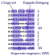

# helclock

## Text

    ESKISTAFÜNF
    ZEHNZWANZIG
    DREIVIERTEL
    VORFUNKNACH
    HALBAELFÜNF
    EINSXAMZWEI
    DREIPMJVIER
    SECHSNLACHT
    SIEBENZWÖLF
    ZEHNEUNKUHR

## Segmente

## LED-Varianten

- Pollin-[Sortiment](https://www.pollin.de/p/sort-led-neopixel-programmierbar-800567) programmierbar, mit SK6812 und WS2812B, 40 Stck 2,95€.
- Digikey-[Kategorie](https://www.digikey.de/de/products/filter/leds-adressierbar-spezialanwendungen/126) für programmierbare LEDs.
- Adafruit-Neopixel 5050 bei [berrybase](https://www.berrybase.de/adafruit-neopixel-5050-rgb-led-mit-integriertem-treiber-10-stueck)
  oder [Mouser](https://www.mouser.de/ProductDetail/Adafruit/3094?qs=SV%252B0z0o3NTt%2F2YK7E3w5Rg%3D%3D) 100 Stck, 25,76€.
- THT-Leds mit WS2812 bei [Berrybase](https://www.berrybase.de/adressierbare-ws2812-rgb-led-pth-5mm-diffus-5er-pack)
- Berrybase [Streifen](https://www.berrybase.de/digitaler-led-rgb-neopixel-stripe-ip65-vergossen-30-leds-schwarz-50cm-mit-kabelanschluss)
  mit 30 LEDs auf 50cm.
- LED-[Matrix](https://eckstein-shop.de/WaveShare-RGB-Full-Color-LED-Matrix-Panel-64x64-Pixels-3mm-Pitch-Adjustable-Brightness) bei Eckstein
- Adressierbare [LED-Streifen](https://www.pololu.com/product/3086) bei Pololu
- Adressierbare [LED-Streifen](https://www.tme.eu/de/details/n013060ca3sa1/lichtquellen-led-bander/ipixel-led/) bei TME.
- Einzelne, adressierbare, programmierbare [LED](https://eu.robotshop.com/products/5mm-adressable-rgb-led-5pk) THT bei RobotShop
- Einzelne, programmierbare LEDs auf Breakout bei [Watterott](https://shop.watterott.com/WS2812B-Breakout-Intelligent-RGB-LED-5-Stk) mit WS2812B-Controller.
THT-LEDs

Berrybase-Streifen

Neopixel 5050

## Analoge LED-Treiber

Kategorie bei [Mouser](https://www.mouser.de/c/semiconductors/driver-ics/led-lighting-driver-ics/)

Als Schieberegister beispielsweise von [TI](https://www.mouser.de/ProductDetail/Texas-Instruments/TLC5916INE4?qs=vPP9GyyTAo06VIPRtWrixw%3D%3D)

## Alternative Projekte

- RPi-[Wordclock](https://github.com/bk1285/rpi_wordclock)
