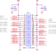

Raspberry Pi library for the LPD8806 from Adafruit

Origin: [Sh4d/LPD8806](https://github.com/Sh4d/LPD8806) on github

http://www.adafruit.com/products/306

Expansion port of Pi 3 B

Pi model of `pi3c` from `cat /proc/device-tree/model`:

    Raspberry Pi 3 Model B Rev 1.2

The Pi image currently in use on `pi3c` from `/boot/issue.txt`:

    Raspberry Pi reference 2023-02-21
    Generated using pi-gen, https://github.com/RPi-Distro/pi-gen, f2d385517c9631f2ded876deb1115725d0c75995, stage4

Activate `spi` on Raspi using `raspi-config`.

Connect:

    Pi MOSI (GPIO10/Pin 19) -> Strand DI/yellow
    Pi SCLK (GPIO11/Pin 23) -> Strand CI/blue

Download, extract, then run the help:

     import LPD8806
     help(LPD8806)

[Gamma?](http://learn.adafruiat.com/light-painting-with-raspberry-pi)
